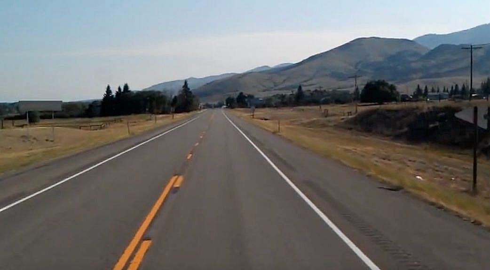
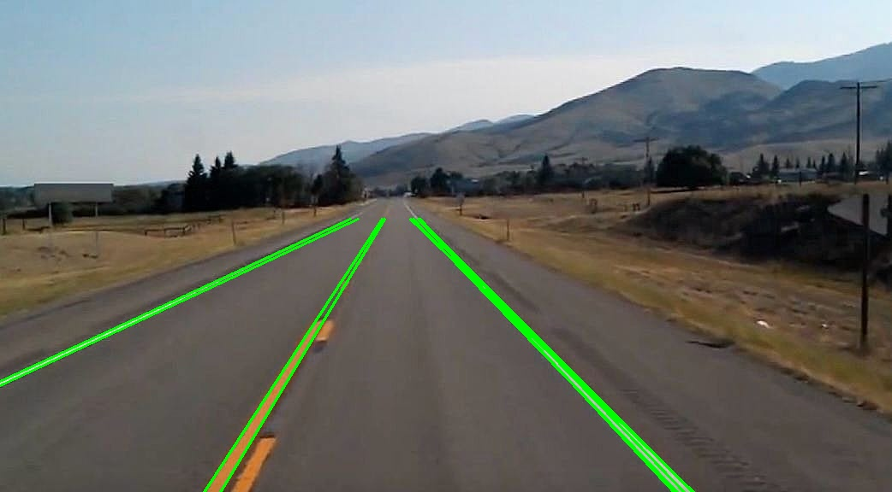

# Road Lane Detection

This project implements a road lane detection system using OpenCV and NumPy. Below are the main functions used in the project along with their explanations and code snippets.

## Functions

### 1. `median_blur`

Applies a median blur to the input image to reduce noise.

```python
def median_blur(img):
    return cv2.medianBlur(img, 7)
```

### 2. `canny_edge_detector`

Applies the Canny edge detection algorithm to the input image to detect edges.

```python
def canny_edge_detector(img):
    return cv2.Canny(img, 100, 200)
```

### 3. `get_ROI_edge`

Extracts the region of interest (ROI) from the edge-detected image and applies a mask.

```python
def get_ROI_edge(edge_img, img, roi_points=None):
    height, width = edge_img.shape[:2]
    mask = np.zeros_like(edge_img)
    cv2.fillPoly(mask, [roi_points], 255)
    masked = cv2.bitwise_and(edge_img, mask)
    masked_img = cv2.bitwise_and(img, img, mask=mask)
    return masked
```

### 4. `hough_transform`

Performs the Hough Transform to detect lines in the edge-detected image.

```python
def hough_transform(image):
    height, width = image.shape
    max_dist = int(np.hypot(height, width))
    thetas = np.deg2rad(np.arange(0, 180))
    rhos = np.linspace(-max_dist, max_dist, max_dist * 2)
    accumulator = np.zeros((len(rhos), len(thetas)), dtype=np.int32)
    y_idxs, x_idxs = np.nonzero(image)
    for i in range(len(x_idxs)):
        x = x_idxs[i]
        y = y_idxs[i]
        for t_idx in range(len(thetas)):
            rho = int(x * np.cos(thetas[t_idx]) + y * np.sin(thetas[t_idx]) + max_dist)
            accumulator[rho, t_idx] += 1
    threshold = 0.4 * np.max(accumulator)
    peaks = np.argwhere(accumulator > threshold)
    refined_peaks = {}
    for peak in peaks:
        rho_idx, theta_idx = peak
        if accumulator[rho_idx, theta_idx] == np.max(accumulator[rho_idx-1:rho_idx+2, theta_idx-1:theta_idx+2]):
            refined_peaks[(rho_idx, theta_idx)] = accumulator[rho_idx, theta_idx]
    return refined_peaks, rhos, thetas
```

### 5. `line_intersection`

Finds the intersection point of two lines.

```python
def line_intersection(line1, line2):
    x1, y1, x2, y2 = line1
    x3, y3, x4, y4 = line2
    denom = (y4 - y3) * (x2 - x1) - (x4 - x3) * (y2 - y1)
    if denom == 0:
        return None
    ua = ((x4 - x3) * (y1 - y3) - (y4 - y3) * (x1 - x3)) / denom
    ub = ((x2 - x1) * (y1 - y3) - (y2 - y1) * (x1 - x3)) / denom
    if 0 <= ua <= 1 and 0 <= ub <= 1:
        x = x1 + ua * (x2 - x1)
        y = y1 + ua * (y2 - y1)
        return int(x), int(y)
    return None
```

### 6. `clip_line_to_polygon`

Clips a line to fit within a polygon.

```python
def clip_line_to_polygon(line, polygon):
    clipped_line = []
    for i in range(len(polygon)):
        p1 = polygon[i]
        p2 = polygon[(i + 1) % len(polygon)]
        intersection = line_intersection(line, (p1[0], p1[1], p2[0], p2[1]))
        if intersection:
            clipped_line.append(intersection)
    return clipped_line
```

### 7. `draw`

Draws the detected lines on the image.

```python
def draw(img, peaks, rhos, thetas, roi_points):
    for (rho_idx, theta_idx), value in peaks.items():
        actual_rho = rhos[rho_idx]
        actual_theta = thetas[theta_idx]
        a = np.cos(actual_theta)
        b = np.sin(actual_theta)
        x0 = a * actual_rho
        y0 = b * actual_rho
        x1 = int(x0 + 1000 * (-b))
        y1 = int(y0 + 1000 * (a))
        x2 = int(x0 - 1000 * (-b))
        y2 = int(y0 - 1000 * (a))
        clipped_line = clip_line_to_polygon((x1, y1, x2, y2), roi_points)
        if len(clipped_line) == 2:
            cv2.line(img, clipped_line[0], clipped_line[1], (0, 255, 0), 2)
    cv2.imshow('Lines', img)
    cv2.imwrite('Lines.jpg', img)
```

### 8. `main`

Main function to execute the lane detection pipeline.

```python
def main():
    test_img = cv2.imread('test.jpg')
    height, width = test_img.shape[:2]
    roi_points = np.array([
        [width, height],
        [0, height],
        [0, height - 160],
        [width * 1 // 4, height * 4 // 9],
        [width * 2 // 4, height * 4 // 9]
    ], dtype=np.int32)
    blurried_img = median_blur(test_img)
    edge_img = canny_edge_detector(blurried_img)
    roi_img = get_ROI_edge(edge_img, test_img, roi_points)
    refined_peaks, rhos, thetas = hough_transform(roi_img)
    draw(test_img, refined_peaks, rhos, thetas, roi_points)
    cv2.imshow('ROI', roi_img)
    cv2.imshow('Edge', edge_img)
    cv2.imshow('Blur', blurried_img)
    cv2.waitKey(0)
    cv2.destroyAllWindows()

if __name__ == '__main__':
    main()
```

## Usage

To run the lane detection system, execute the `main.py` script. Ensure you have OpenCV and NumPy installed in your Python environment.

```bash
python main.py
```

Make sure to place a test image named `test.jpg` in the same directory as the script.

## Result
### Test Image

Below is an example of the test image used for lane detection:



### Detected Lines

Below is the result image with detected lanes drawn:

